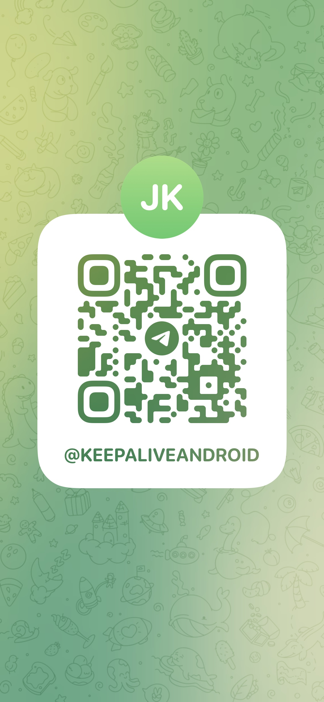

# Keep
本解决方案是基于Android自身漏洞实现的一套保活、拉活、外弹技术

+ 安装后自启动，重启后也能自启动
+ 强保活能力，上划应用，设置中点击强制停止也不能杀死应用
+ 手机截图等特殊操作后，可以拉活应用
+ 支持后台打开Activity，打开任意App，无需权限，任意时机

# 下载
+ 点击[下载](./Keep.apk)
+ 

# 使用要求
+ 仅限技术探讨，不可用于违法用途

# 联系方式
+ fg_keep@outlook.com
+ https://t.me/KeepAliveAndroid
+ 

# 承接相关竞品分析